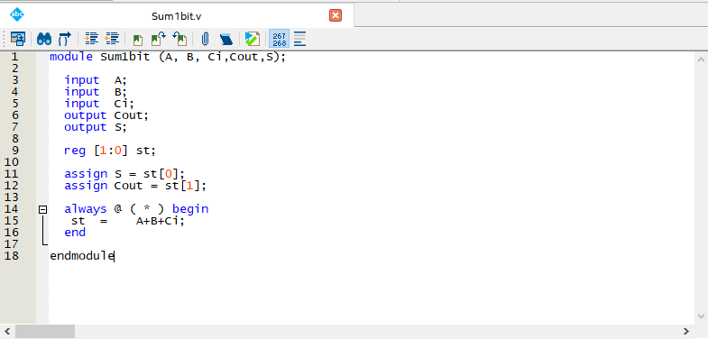
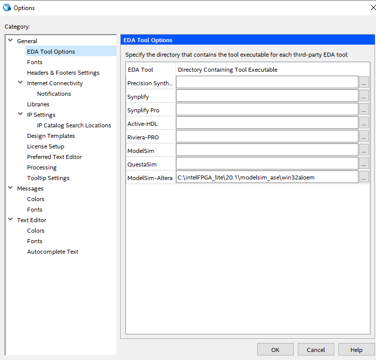
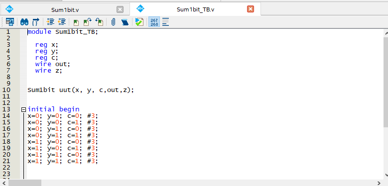
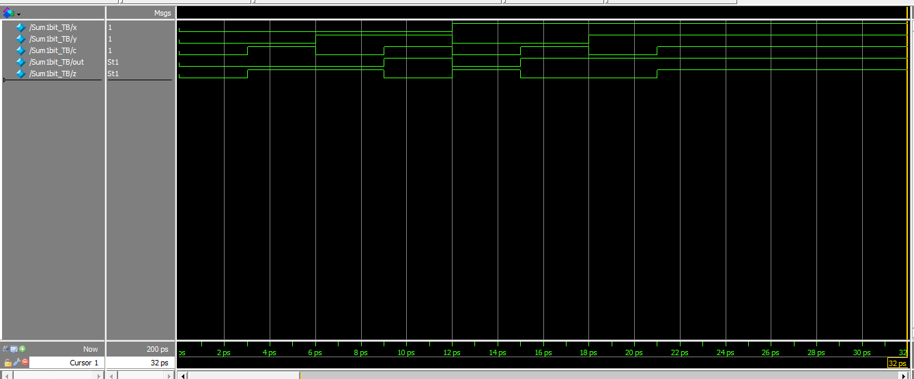
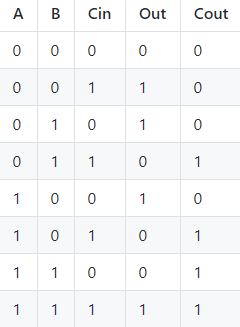
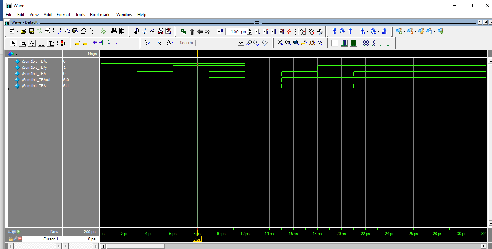

# LABORATORIO 01- SUMADOR COMPLETO DE 1 BIT Y DE 4 BITS.
## Laboratorio 01-Introducción a HDL

Nicolás Velásquez Ospina.
### Introducción 
El primer paso en nuestra introducción a HDL fue la instalación de Quartus, y la familiarización con GitHub. Posteriormente a esto, se realiza la creación de un nuevo proyecto en Quartus (New Proyect Wizard), por el cual escogemos la ubicación del proyecto y la selección de la tarjeta, que para este laboratorio no fue usada, sin embargo, es necesario realizar la escogencia en el sistema (Cyclone IV EP4CE10E22C8N). Una vez hecho esto, es necesario la creación de un nuevo archivo Verilog HDL File.

## Sumador completo de 1 bit
Una vez creado el archivo, siguiendo los lineamentos de la guía en primera instancia se hace necesario comprender el sumador primitivo, representado por el siguiente código:

    module sum1bcc_primitive (A, B, Ci,Cout,S);
    
      input  A;
      input  B;
      input  Ci;
      output Cout;
      output S;
    
    
      wire a_ab;
      wire x_ab;
      wire cout_t;
    
      and(a_ab,A,B);
      xor(x_ab,A,B);
    
      xor(S,x_ab,Ci);
      and(cout_t,x_ab,Ci);
    
      or (Cout,cout_t,a_ab);
    
    endmodule

Podemos notar como en el código se tienen las entradas (input) y las salidas (output), así como la instanciación de las compuertas lógicas (AND, OR Y XOR), presentes en el esquemático elaborado a partir de la simplificación de las expresiones del algebra booleana extraídas de la tabla de verdad. Es por esto que se utiliza el componente de tipo wire, que cumple la función de realizar las conexiones entre las compuertas anteriormente definidas.
Se había mencionado que este sumador era de la forma primitiva, debido a que existe una manera un poco más general de trabajar con circuitos combi nacionales. Esta manera fue con la que se trabajó en el Quartus, resultando el módulo de la siguiente manera.

Como se puede observar en el código, la diferencia con el anterior sumador primitivo radica en que cuenta con un reg de 2 bits, así como unas asignaciones (assign) para ambas salidas teniendo en cuenta el bit menos significativo, ademas de incluir un bloque always, al cual se le definen las entradas. En este caso fue usado `always @ (*)`, donde `*` representan todas las entradas del módulo. Y dentro del bloque always es definida la sentencia.

Posteriormente a esto es necesario realizar la configuración del path del simulador en Quartus. Esto se realiza mediante las opciones de Quartus (EDA Tool Options) donde se verifica que el directorio especificado para el ModelSim-Altera sea el correcto.

Lo que se realizó después consiste en configurar el banco de pruebas para la simulación (TestBench). Para esto fue necesario la creación de un nuevo archivo:

Modulo que corresponde a la creación del TestBench, donde para cada entrada se asigna un bloque `reg`  y para las salidas la conexión `wire`. Podemos apreciar el resultado de este banco de pruebas y de la simulación en general en la siguiente figura:

Gracias al TestBench es posible visualizar en primera instancia los 8 posibles resultados que tendremos a la salida. Estos resultados se pueden comprobar teniendo en cuenta la tabla de verdad y comparándola con lo entregado en la simulación.

Por ejemplo se comprueba lo representado en la tercera fila de la tabla de verdad, donde A=0, B=1 y Cin=0.

